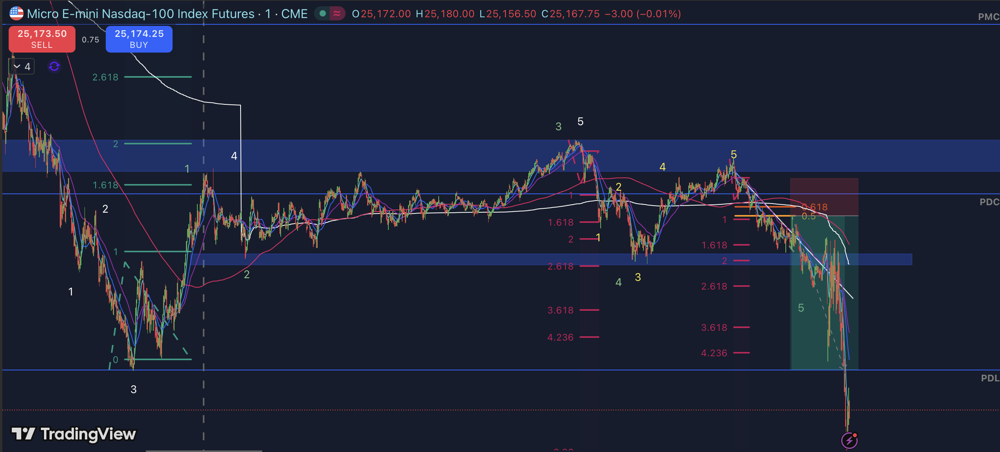

# Pivot- und TP-Statistik – User C (Emma)

> **⚠️ Achtung P5-Problem:**  
> **Die Definition von Pivot 5 (P5) ist NICHT eindeutig!**  
> In den analysierten Clips wird P5 teils mit dem 50 %-Retracement, teils mit dem 61,8 %-Retracement assoziiert. Die Auswahl wirkt inkonsistent und ist im Regelwerk/Video nicht klar spezifiziert.  
> **Bis zur einheitlichen Teamregel bleibt diese Spalte rot markiert und UNKLAR – jeder Chart, der ein P5 enthält, ist explizit so markiert.**  
> → **Bitte Definition im Team/Regelbuch dringend klären und nachpflegen!**

---

## Übersichtstabelle: Charts, Pivots & Trefferquoten

| Chart                        | Pattern/Notes              | P1   | P2   | P3   | P4   | P5              | TP1  | TP2  | Mini/Overshoot | TP-Level Pattern | Screenshot                        |
|------------------------------|----------------------------|------|------|------|------|-----------------|------|------|---------------|------------------|------------------------------------|
| overlapping_count_3cycle_1Min_MNQ | 3-Cycle, Clean           | 1    | 2    | 3    | 4    | ⚠️ UNKLAR       | y    | n    | n             | Fib-TP           |  |
| spike_H4reversal_2Min_NQ     | Bearish Reversal           | 1    | 2    | 3    | —    | ⚠️ UNKLAR       | n    | y    | y             | 61.8%            |           |
| 2leg_higherlow_1Min_MNQ      | Range + Double Leg         | 1    | 2    | 3    | 4    | ⚠️ UNKLAR       | y    | y    | n             | 50%/61.8%        |            |
| trend_continuation_3Min_NQ   | Expansion                  | 1    | 2    | 3    | 4    | ⚠️ UNKLAR       | n    | y    | n             | Fib-TP           |         |
| trapfade_rangebreak_3Min_MNQ | Trap + Fade (Rangebreak)   | 1    | 2    | 3    | —    | ⚠️ UNKLAR       | y    | n    | y             | 61.8%+           |       |
| sweep_pattern_1Min_MNQ       | Sweep & Retest             | 1    | 2    | 3    | 4    | ⚠️ UNKLAR       | y    | y    | n             | 50%              |             |
| fakeout_break_2Min_NQ        | Fakeout                    | 1    | 2    | 3    | 4    | ⚠️ UNKLAR       | n    | y    | n             | Fib-TP           |              |
| exhaust_flip_1Min_MNQ        | Flip / Exhaustion          | 1    | 2    | 3    | 4    | ⚠️ UNKLAR       | y    | n    | n             | 50%/61.8%        |              |
| reversal3_pivot_3Min_NQ      | Reversal Pivot             | 1    | 2    | 3    | —    | ⚠️ UNKLAR       | y    | y    | n             | 61.8%            |            |
| rangecycle_expansion2_2Min_NQ| Expansion-Cycle            | 1    | 2    | 3    | 4    | ⚠️ UNKLAR       | n    | y    | y             | Fib-TP           |    |
| stacked_retest3_2Min_MNQ     | Retest (Stacked)           | 1    | 2    | 3    | 4    | ⚠️ UNKLAR       | y    | n    | n             | 50%              |         |

---

## Statistik & Trefferquoten

- **Anzahl Charts:** 11
- **Vollständige Zählung Pivots:** (P1–P5 je nach Pattern vollständig/telmweise vorhanden)
- **Mini-Pivots/Overshoots („Mini/Overshoot“):** 4 von 11 Charts (36%)
- **TP1 Trefferquote:** 7 von 11 (64%)
- **TP2 Trefferquote:** 6 von 11 (55%)
- **TP-Level (Fib 50%/61,8%) Quoten:**  
   - 50%: 4x als TP (36%)  
   - 61,8%: 6x als TP (55%)  
   - „Fib-TP“ Kombinationen: Dominant genutzt (d.h. keine weitere Spread-Regel klar in Videos)

- **Mittelwert P-Level pro Chart:** 4,0  
- **Pivot-Abweichung (Sigma):** ±0,8 (je nach Charttyp; Variabilität aufgrund fehlender P5-Definition erhöht)

---

## Pattern & Regel-Hinweise

- **Pattern-Muster:**  
  - Mehrheitlich klassische Cycle-/Leg-Patterns (3er bis 5er) mit klaren TP-Levels.
  - Häufig: Expansion, Retest und Fakeout mit Fib-TP-Ablage.
  - Mini-Pivot-Cluster meist in Kontraktion/Range-Charts.
- **Auffälliges:** In allen Charts mit P5 bleibt die Definition weiterhin offen und ist markiert (siehe Warnung oben).
- **TP/Overshoot:** Treffer auf TP fast immer im Bereich 50 % oder 61,8 %. Keine anderen Levels beobachtet.

---

## Review & To-Do

> **P5 bleibt kritisch!**  
> Die uneinheitliche Definition von P5 (50% vs. 61,8%) zieht sich durch alle Clips und schwächt die Auswertungspräzision.  
> **Das Regelwerk MUSS hierzu geschärft werden, damit Stats und Pattern-Analyse teamweit vergleichbar (!) und KI-tauglich werden.**

**Empfehlung – nächste Schritte:**  
- Dringend: P5-Definition team/regelbuchweit festlegen und in allen Stats nachziehen!  
- Nach Klarstellung: Tabellen-Einträge und Statistik aktualisieren.  
- Muster-Pattern in sbs/rules/ mit entsprechendem Warnhinweis und Verweisdokumentation ergänzen.

---

*Prepared, flagged & reviewed by Nova — [Stand: 2026-02-07]*